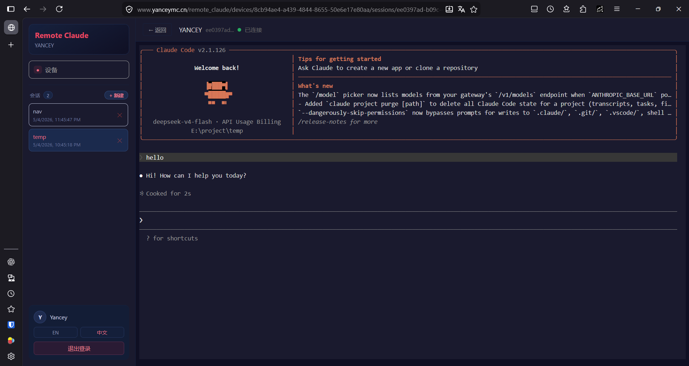
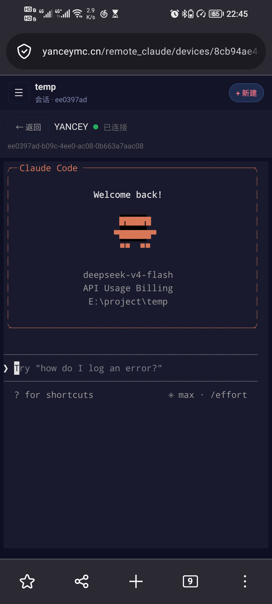

# Remote Control Claude Code

通过 WebSocket/REST 协议远程控制 [Claude Code](https://claude.ai/code) CLI 的中转控制系统。三个独立程序协作实现远程设备管理、会话控制和实时输出查看。

## 架构

```
┌─────────────┐    REST/WS     ┌──────────────────────┐      WS      ┌────────────────────┐
│   Web UI    │ ─────────────> │  remote-claude-server │ ───────────> │ remote-claude-client│
│  (React)    │                │   (Rust / Axum)      │              │ (Rust/tungstenite │
│             │ <───────────── │                      │ <─────────── │   → Claude CLI)   │
│  xterm.js   │   JSON proto   │   SQLite store       │  JSON proto  │                   │
└─────────────┘                └──────────────────────┘              └────────────────────┘
```

- **remote-claude-server** — Rust 中转服务器，管理设备连接、会话路由和用户鉴权
- **remote-claude-client** — Rust 桌面客户端，连接到 remote-claude-server 并在本地执行 Claude CLI 命令
- **web-ui** — React 前端，通过浏览器远程创建会话、下发命令、查看实时输出

## 界面截图

<table>
  <tr>
    <td width="70%"></td>
    <td width="30%"></td>
  </tr>
</table>

## 快速开始

### 1. 启动中转服务器

```bash
cd apps/server

# 首次运行，通过环境变量自动生成配置文件
ADMIN_USER=admin ADMIN_PASS=admin123 JWT_SECRET=change-me cargo run

# 或直接创建配置文件后运行
cargo run
```

### 2. 生成客户端令牌

```bash
# 登录获取 JWT
TOKEN=$(curl -s -X POST http://127.0.0.1:8080/api/auth/login \
  -H "Content-Type: application/json" \
  -d '{"username":"admin","password":"admin123"}' | jq -r '.token')

# 生成客户端令牌
CLIENT_TOKEN=$(curl -s -X POST http://127.0.0.1:8080/api/admin/tokens \
  -H "Authorization: Bearer $TOKEN" | jq -r '.token')

echo $CLIENT_TOKEN
```

### 3. 启动桌面客户端

```bash
cd apps/client

CLIENT_TOKEN=<上一步生成的令牌> SERVER_URL=ws://127.0.0.1:8080/ws/client cargo run
```

> 如果未提供 `CLIENT_TOKEN`（配置文件和环境变量均缺失），程序会交互式提示输入令牌，输入后自动保存到配置文件，后续启动无需重复填写。

### 4. 启动网页前端

```bash
cd apps/web
pnpm install
pnpm dev          # → http://localhost:5173 (Vite proxy → localhost:8080)
```

### 5. Docker 部署

```bash
# 从 Docker Hub 拉取（推荐）
docker pull yanceyawa/remote-claude

# 或自行构建（自动编译 remote-claude-client 二进制到 /app/downloads）
docker build -t yanceyawa/remote-claude .

# 运行
docker run -d --name remote-claude -p 8080:8080 \
  -e ADMIN_USER=admin \
  -e ADMIN_PASS=admin123 \
  -e JWT_SECRET=change-me \
  -v claude-config:/app/config \
  -v claude-data:/app/data \
  yanceyawa/remote-claude
```

如需使用 Docker Compose，可自行创建 `docker-compose.yml`：

```yaml
services:
  remote-claude:
    image: yanceyawa/remote-claude
    ports:
      - "8080:8080"
    volumes:
      - claude-config:/app/config
      - claude-data:/app/data
    environment:
      - ADMIN_USER=admin
      - ADMIN_PASS=admin123
      - JWT_SECRET=change-me
    restart: unless-stopped

volumes:
  claude-config:
  claude-data:
```

## 项目结构

```
├── apps/server/       Rust 中转服务器 (axum + tokio + sqlx)
├── apps/client/     Rust 电脑客户端 (tokio-tungstenite)
├── apps/web/             React 前端 (Vite + TypeScript + xterm.js)
├── package/shared-types/       共享 TypeScript 类型定义
├── Dockerfile          多阶段构建镜像（中转服务器 + 客户端二进制）
├── .github/workflows/   GitHub Actions CI/CD (ci/docker/release)
└── pnpm-workspace.yaml
```

## CI/CD

| 工作流 | 触发 | 操作 |
|--------|------|------|
| `ci.yml` | push main / PR | 构建 + 测试全部三个项目 |
| `docker.yml` | push main / v* tag | 构建并推送 Docker 镜像到 Docker Hub，自动部署到服务器 |

发布新版本：

```bash
git tag v0.1.0
git push --tags
```

GitHub Actions 自动构建 remote-claude-server 和 remote-claude-client 的 Linux/Windows 二进制文件、web-ui 静态资源包，并创建 Release 页面。

## 配置

配置文件优先，环境变量仅作为首次运行时的初始值来源。

| 程序 | 配置文件路径 |
|------|-------------|
| remote-claude-server | `config/remote-claude-server.toml` |
| remote-claude-client | `config/remote-claude-client.toml` |
| web-ui | 构建时 `VITE_BASE_URL` 编译进 bundle，无运行时配置文件 |

通过 `CONFIG_PATH` 环境变量可覆盖配置文件路径。

`remote-claude-server` 启动时会自动创建 SQLite 数据库文件（以及缺失的父目录）。Docker 镜像默认使用 `/app/data/data.db`，并为 `/app/config`、`/app/data` 提供可写权限，便于在非 root 用户下运行。

## 协议

### REST API

| 方法 | 路径 | 鉴权 | 说明 |
|------|------|------|------|
| POST | `/api/auth/login` | 无 | 登录，返回 JWT |
| POST | `/api/auth/logout` | JWT | 登出 |
| POST | `/api/auth/verify` | JWT | 验证 token 有效性 |
| GET | `/api/devices` | JWT | 设备列表 |
| DELETE | `/api/devices/:id` | JWT | 删除设备 |
| POST | `/api/sessions` | JWT | 创建设备控制会话 |
| GET | `/api/sessions` | JWT | 会话列表 |
| GET | `/api/sessions/:id` | JWT | 获取会话详情 |
| DELETE | `/api/sessions/:id` | JWT | 关闭会话 |
| POST | `/api/admin/users` | Admin | 创建用户 |
| GET | `/api/admin/users` | Admin | 用户列表 |
| DELETE | `/api/admin/users/:id` | Admin | 删除用户 |
| PATCH | `/api/admin/users/:id/status` | Admin | 启用/禁用用户 |
| POST | `/api/admin/tokens` | Admin | 生成客户端令牌 |
| GET | `/api/admin/tokens` | Admin | 令牌列表 |
| DELETE | `/api/admin/tokens/:token` | Admin | 撤销令牌 |

### WebSocket 协议

- **设备通道** `/ws/client` — 设备注册、心跳、命令下发、结果回传
- **Web 通道** `/ws/web` — 创建会话、下发命令、接收实时输出

详见 [CLAUDE.md](CLAUDE.md) 协议章节。

## 运行测试

```bash
cd apps/server && cargo test    # 94 个测试
cd apps/client && cargo test  # 32 个测试
cd apps/web && pnpm test           # 101 个测试
```

## 技术栈

- **后端**: Rust (Axum, Tokio, sqlx, tokio-tungstenite)
- **前端**: React, TypeScript, Vite, xterm.js
- **存储**: SQLite
- **容器**: Docker 多阶段构建
- **密码**: Argon2 哈希
- **鉴权**: JWT Bearer Token
